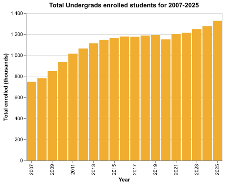
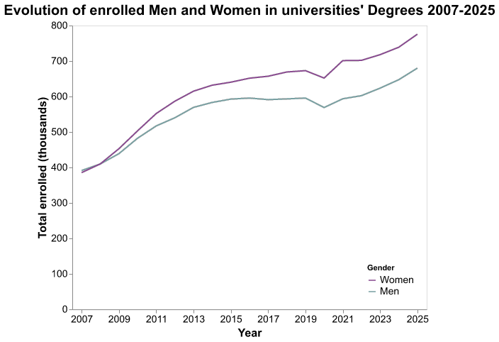
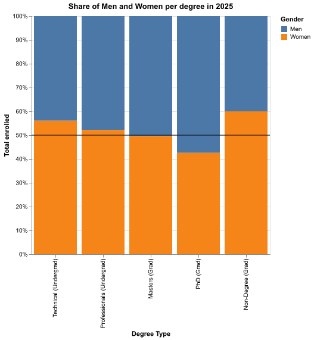

# {Universities Chile}

Agustín Eyzaguirre

## What is your current goal? Has it changed since the proposal?

It changed completely. At first I was going to show the current status and
comparisons of educational levels across different countries, but data was mostly
numerical and there wasn't too much to show.
Now, Im showing an overview of evolution of Tertiary education (after high School)
in Chile during the last 20 years.

## Are there data challenges you are facing? Are you currently depending on mock data?

No, I'm relying in clean datasets. Details:

### Dataset 1: Enrolled students and careers in Chile for 2007-2025 (too big to upload)
##### url: https://www.kaggle.com/datasets/gustavoreyesc/matriculados-en-educacin-superior-chile-2007-2025/data

### Dataset 2: Spending on Primary, Secondary and Tertiary Education as % of GDP 2007-2021
#### url: https://ourworldindata.org/grapher/education-spending?country=%7ECHL&overlay=download-data&spending_type=gdp_share&level=level_side_by_side

## Describe each of the provided images with 2-3 sentences to give the context and how it relates to your goal.

### 1. Evolution of Spending (% of GDP) by Education Level

The chart below shows how much Chile has been spending on **primary**, **secondary**, and **tertiary** education as a share of its GDP between **2007 and 2021**.

### 2. Evolution total students of undergrads, and grad students 2007-2025

This line chart shows the total number of enrolled students for undergrads, grads and diploma students
in Chile for the period 2007-2025

### 3. Evolution Total male and female students of overall enrolled

The following chart shows the growth of male and females students during 2007-2025

### 4. Out of undergrads, relation of professional and technical undergrads

The following chart shows the relation out of undergrads of students studying technical careers and professional careers

### 5. Differences of study areas between men and women

The following chart shows the ranking of top enrolled number of students of
knowkledge areas, comparing men and women for the 2007-2025 period

### 6. Where in Chile are they studying at 2025

The following Chart shows the number of univerisity student in each region of
Chile ordered from north to South at 2025

### 7. Career length and Study field for 2025

The following Chart shows how long are careers per field study for Professional Careers of Undergrads in 2025

### 8. Share of Men and Women per degree type in 2025

The following Chart shows what's the distribution of men and women per degree type in 2025

## What form do you envision your final narrative taking? (e.g. An article incorporating the images? A poster? An infographic?)

I'm planning to do an infographic
